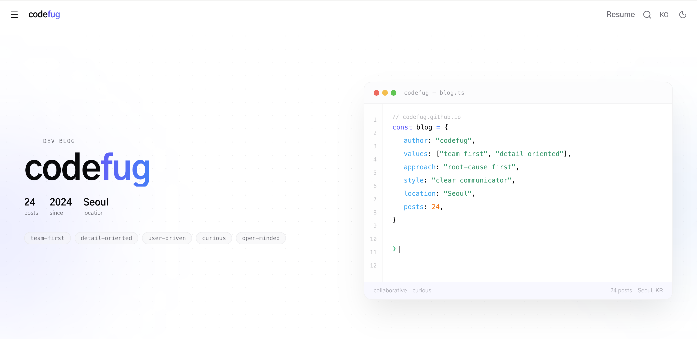

**Developer**

I don't stop until the problem is truly solved.  
I document everything I fix, learn, and discover — turning personal improvements into growth for the whole team.

---

---

---

&nbsp;&nbsp;🛜 &nbsp;[Blog](https://codefug.github.io)
 
&nbsp;&nbsp;📄 &nbsp;[Resume](https://codefug.github.io/resume/)&nbsp;&nbsp;
 
&nbsp;&nbsp;💼 &nbsp;[LinkedIn](https://www.linkedin.com/in/lee-seung-hyun)&nbsp;&nbsp;
 
&nbsp;&nbsp;✉️ &nbsp;[Email](mailto:leeseounghyun9917@gmail.com)

